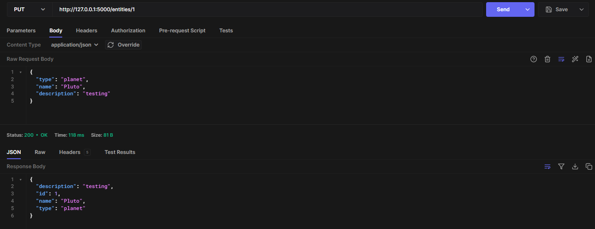
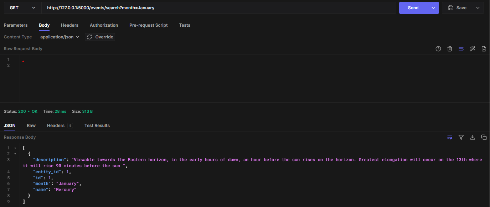

## API Webserver Project: NightSky :first_quarter_moon_with_face:<!-- omit from toc -->

## Table of Contents<!-- omit from toc -->
- [R1. Identification of the problem you are trying to solve by building this particular app.](#r1-identification-of-the-problem-you-are-trying-to-solve-by-building-this-particular-app)
- [R2. Why is it a problem that needs solving?](#r2-why-is-it-a-problem-that-needs-solving)
- [R3. Why have you chosen this database system? What are the drawbacks compared to others?](#r3-why-have-you-chosen-this-database-system-what-are-the-drawbacks-compared-to-others)
- [R4. Identify and discuss the key functionalities and benefits of an ORM](#r4-identify-and-discuss-the-key-functionalities-and-benefits-of-an-orm)
- [R5. Document all endpoints for your API](#r5-document-all-endpoints-for-your-api)
  - [USERS](#users)
  - [DIARIES](#diaries)
  - [MEETINGS](#meetings)
  - [GROUPS](#groups)
  - [ENTITIES](#entities)
  - [EVENTS](#events)
- [R6. An ERD for your app](#r6-an-erd-for-your-app)
- [R7. Detail any third party services that your app will use](#r7-detail-any-third-party-services-that-your-app-will-use)
- [R8. Describe your project models in terms of the relationships they have with each other](#r8-describe-your-project-models-in-terms-of-the-relationships-they-have-with-each-other)
- [R9. Discuss the database relations to be implemented in your application](#r9-discuss-the-database-relations-to-be-implemented-in-your-application)
- [R10. Describe the way tasks are allocated and tracked in your project](#r10-describe-the-way-tasks-are-allocated-and-tracked-in-your-project)
- [Reference List](#reference-list)

## R1. Identification of the problem you are trying to solve by building this particular app.

Stargazing can be an exciting and fascinating hobby to learn. However the subject of astronomy is often difficult and confusing to navigate for beginners. With this app, I hope to  provide the general public with an easy and accessible way of understanding how to traverse the night skies by readily supplying timings and locations for celestial bodies and phenomenons in simple terms and descriptions. By making stargazing more straightforward and uncomplicated, there’s a greater ease of entry to learn sciences and astronomy whilst also ultimately serving as a reminder to everyone that you only really need to look up to see some of the universe's most beautiful wonders and gifts :star2: 

## R2. Why is it a problem that needs solving?

Viewing astronomical events can be quite confusing as timings largely depend on where you are located on Earth. This particular API is designed for a specific target audience and aims to be managed and utilised by Victorians as it provides data specific to this location group. This way, there is no confusion about times and locations when viewing data. Further, many astronomy applications are often hard to navigate as they use confusing coordinates for locations, have millions of objects available for users to track, require telescopes and good map skills. This can be overwhelming for those new to stargazing. Thus, this application targets specifically those who are new or casual astronomers as well as the general public by providing simple descriptions and details of viewing locations/times and tracks significant objects such as the planets in our solar system and large stars that are visible to the naked eye without the need of telescopes. 

In addition, as someone who is new to a hobby, it is often hard to make local friends and meet new people, especially in this field as it is a niche hobby. To solve this problem, the app also acts as a platform to connect these new astronomers with fellow enthusiasts through an organised meetup feature. 


## R3. Why have you chosen this database system? What are the drawbacks compared to others?

PostgreSQL is the chosen database system which has a wide range of benefits to suit the needs and requirements of this project. It is a powerful open-source system used extensively in industry for its reliability, speed and efficacy. Firstly, postgres supports a large number of data types which include simple data types such as  numeric, string, boolean and datetime but can also support more complex data types such as JSONB (used to store and operate JSON objects) which is used extensively in this project. The data systems’ infrastructure involves use of constraints and data verification systems which ensure data integrity and reduces the risks of data loss. In addition, it also has a robust privilege management system for authentication and authorisation. These functionalities allow users to control who and what access is available to different parties. For this project in particular, there are login features which require passwords to be stored thus it’s essential for database administrators to have control over authorisation. Finally, postgres also supports third party extensions, tools and programming languages, one of which is python which is what will be used for the majority of the source code in this project. 

#### Drawbacks to alternative database systems: <!-- omit from toc -->

Postgres is not the best for real time data processing whereby DBMS such as Apache Kafke or StreamSQL would be more useful as they include functionalities that enable real time analytics.

MySQL database systems are designed to be more streamlined and simple so they are optimised for speed. This, smaller projects with simpler queries would benefit more from utilising the simplicity and increased processing speed of mySQL over postgres. 

One thing to note is that although MySQL has a simpler setup, because postgreSQL offers more tools to handle complex queries and data types in larger volumes, for future scalability of the project, it is worthwhile opting to use postgreSQL. Particularly for this project, using postgreSQL ensures that if in the future, the application is to expand its location scope to provide services to other regions besides Victoria, the database is able to handle growing volumes of data. 

A drawback of postgres against MongoDB is that it relies on relational data models. Hence if an application does not require relational data, a less rigid and more adaptable database system such as MongoDB may be better suited. This system does not require data to be stored in tabular form which relies on strict normalisation procoles which can bottleneck the development phase. Schemas are not so inflexible in that they do not need to be predefined as they do in relational databases. 


## R4. Identify and discuss the key functionalities and benefits of an ORM


Object relational mapping (ORM) is a programming tool for enabling a connection between relational database systems and object oriented programming languages. It involves converting the object into data to be stored, retrieved or reconstructed when required and through ORM, these changes made to the object are shared and updated to the database. Consequently, developers now have a method of working with data in the form of objects whilst data is stored and managed in a relational database using SQL.

Abstraction is the basis of ORM in that ORM tools allow manipulation of objects regardless of how they relate to their data source. A useful feature applicable to this project is the ability to map out relational databases with objects and tables that have one-to-many, many-to-many or one-to-one relationships. Further, embedded in ORMs is the ability to perform CRUD (creating, reading, updating, deleting) operations without directly using SQL using object oriented programming tools. 

#### Benefits of ORM:<!-- omit from toc -->

Improves efficiency and productivity: Developers can prioritise app development and business logic over database concerns as database queries are handled by the ORM system. By abstracting the complexities when using databases, developers can focus on delivering high quality solutions and increase overall productivity. 

Promotes code reusability: Application logic and database are two separate systems which means developers can reuse code for similar database systems without concern for specific SQL language. 

Security Features: ORM systems have in-built security features which can prevent malicious input from affecting databases as well as features that allow users to set permission and access rules to prevent unauthorised access to data. 


## R5. Document all endpoints for your API

### USERS
### 1a. /user/signup/<!-- omit from toc -->
<u> Method</u>: [POST]

<u>Description</u>: Allows new users to sign up to the application.

<u>Required body input</u>: name, email, password, phone

<u>Expected response</u>: 201 OK with name, phone, JWT token and email.


### 1b. /user/signin/<!-- omit from toc -->
<u>Method</u>: [POST]

<u>Description</u>: Allows users to log into the application, checks if email and password exist and match.

<u>Required body input</u>: email, password

<u>Expected response</u>: 200 OK with the users email and a JWT token

<u>Validation/Authorisation</u>: An error message is returned if email and password does not match


### 1c./user/<!-- omit from toc -->
<u>Method</u>: [DELETE]

<u>Description</u>: Allows admins to delete a user

<u>Required body input</u>: n/a

<u>Expected response</u>: 200 OK with the users email and a JWT token

<u>Validation/Authorisation</u>: An error message appears if you are not an admin or there is no user entry 


### DIARIES

### 2a. /diaries/<int: id>/<!-- omit from toc -->

<u>Method</u>: [GET]

<u>Description</u>: Allows user to retrieve one diary entry

<u>Required body input</u>: n/a

<u>Expected response</u>: 200 OK with diary entry and user information (email and name)

<u>Validation/Authorisation</u>: An error message appears if you try to access another users’ diary or the diary does not exist


### 2b. /diaries/users/<int: id>/<!-- omit from toc -->
<u>Method</u>: [GET]

<u>Description</u>: Allows user to retrieve all diaries

<u>Required body input</u>: n/a

<u>Expected response</u>: 200 OK with all diary entries belonging to the user

<u>Validation/Authorisation</u>: An error message appears if you try to access another users’ diary or the diary does not exist


### 2c. /diaries/<!-- omit from toc -->
<u>Method</u>: [POST]

<u>Description</u>: Allows user to make a diary entry

<u>Required body input</u>: title, description

<u>Expected response</u>: 200 OK with the new entry including title, description, post id, date and users info (email and name)

<u>Validation/Authorisation</u>: An error message appears if you leave a field missing


### 2d. /diaries/<int: id>/<!-- omit from toc -->
<u>Method</u>: [PUT, PATCH]

<u>Description</u>: Allows user to edit their own diary entries

<u>Required body input</u>: title, description

<u>Expected response</u>: 200 OK with the updated entry including title, description, post id, date and users info (email and name)

<u>Validation/Authorisation</u>: An error message appears if you leave a field 
missing or if you try to edit an entry that does not belong to you.


### 2e. /diaries/<int: id>/<!-- omit from toc -->
<u>Method</u>: [DELETE]

<u>Description</u>: Allows user/admin to delete their own diary entries

<u>Required body input</u>: title, description

<u>Expected response</u>: 200 OK the details of the deleted entry

<u>Validation/Authorisation</u>: An error message appears if no entry exists or you are not the owner or admin.


### MEETINGS

### 3a. /meetings/<!-- omit from toc -->
<u>Method</u>: [GET]

<u>Description</u>: Allows users to get a list of all meetings

<u>Required body input</u>: N/A

<u>Expected response</u>: 200 OK with a list of all meetings

<u>Validation/Authorisation</u>: An error message appears you are not logged in


### 3b. /meetings/<int: id>/<!-- omit from toc -->
<u>Method</u>: [GET]

<u>Description</u>: Allows users to get one specific meeting.

<u>Required body input</u>: N/A

<u>Expected response</u>: 200 OK meeting details of one specific meeting.

<u>Validation/Authorisation</u>: An error message appears you are not logged in or if the meeting id does not exist.


### 3c. /meetings/<int: id>/<!-- omit from toc -->

<u>Method</u>: [PUT, PATCH]

<u>Description</u>: Allows meeting leader(user)  to edit a meeting

<u>Required body input</u>: title, description, date, location, time

<u>Expected response</u>: 200 OK with updated meeting details 

<u>Validation/Authorisation</u>: An error occurs when you try to edit a meeting you are not the leader of(did not create). Error also when date is not entered correctly. 


### 3d. /meetings/<!-- omit from toc -->
<u>Method</u>: [POST]

<u>Description</u>: Allows users to create a new meeting

<u>Required body input</u>: title, description, date, location, time

<u>Expected response</u>: 200 OK with new meeting details

<u>Validation/Authorisation</u>: Error when you are not logged in, when fields are missing or when date is not entered correctly. 


### 3e. /meetings/<!-- omit from toc -->

<u>Method</u>: [DELETE]

<u>Description</u>: Allows meeting leaders or admins to delete a meeting entry

<u>Required body input</u>: n/a

<u>Expected response</u>: 200 OK with deleted entry

<u>Validation/Authorisation</u>: An error occurs when the entry is not found or you are not the leader/admin.


### GROUPS

### 4a. /groups/<!-- omit from toc -->
<u>Method</u>: [GET]

<u>Description</u>: Allows users to get a list of all members that are in a group with their details.

<u>Required body input</u>: n/a

<u>Expected response</u>: 200 OK with listing

<u>Validation/Authorisation</u>: Error when no authentication bearer


### 4b. /groups/<int: id>/<!-- omit from toc -->
<u>Method</u>: [GET]

<u>Description</u>: Allows users to get a list of members of a specific group meeting

<u>Required body input</u>: n/a

<u>Expected response</u>: 200 OK with listing of members

<u>Validation/Authorisation</u>: Error when group does not exist


### 4c. /groups/<!-- omit from toc -->

<u>Method</u>: [POST]

<u>Description</u>: Allows users to add  themselves to a group meeting

<u>Required body input</u>: meeting id 

<u>Expected response</u>: 200 OK with the users details nested in the meeting number

<u>Validation/Authorisation</u>: Error when no authentication bearer


### 4d. /groups/<int: id>/<!-- omit from toc -->

<u>Method</u>: [DELETE] 

<u>Description</u>: Allows users to delete themselves from a meeting

<u>Required body input</u>:  n/a

<u>Expected response</u>: 200 OK with the users details nested in the meeting number

<u>Validation/Authorisation</u>: Error when no entry exists


### ENTITIES
### 5a. /entities/<!-- omit from toc -->

<u>Method</u>: [GET]

<u>Description</u>: Allows users to get a list of all the entities

<u>Required body input</u>: n/a

<u>Expected response</u>: 200 OK with a list of all the entities

<u>Validation/Authorisation</u>: Error when no authentication bearer


### 5b. /entities/search/<!-- omit from toc -->

<u>Method</u>: [GET]

<u>Description</u>: Allows users to filter entities by type (star or planet)

<u>Required body input</u>: n/a

<u>Expected response</u>: 200 OK with a list of all the entities

<u>Validation/Authorisation</u>: Error when no authentication bearer


### 5c. /entities/<!-- omit from toc -->

<u>Method</u>: [POST]
<u>Description</u>: Allows admins to post new entities

<u>Required body input</u>: name, description, type

<u>Expected response</u>: 200 OK with details of new entities

<u>Validation/Authorisation</u>: Error when missing field or when type is not one of planet or star


### 5d. /entities/<int: d>/<!-- omit from toc -->

<u>Method</u>: [PUT, PATCH]

<u>Description</u>: Allows admins to edit existing entities

<u>Required body input</u>: name, description, type

<u>Expected response</u>: 200 OK with details of new entity

<u>Validation/Authorisation</u>: Error when type is not one of planet or star or when entity does not exist. 



### 5e. /entities/<int: id>/<!-- omit from toc -->

<u>Method</u>: [DELETE]

<u>Description</u>: Allows admins to delete existing entities

<u>Required body input</u>: n/a

<u>Expected response</u>: 200 OK with details of deleted entities

<u>Validation/Authorisation</u>: Error when entity does not exist. 


### EVENTS
### 6a. /events/<!-- omit from toc -->

<u>Method</u>:: [GET]

<u>Description</u>:: Allows users to get a list of all the events

<u>Required body input</u>:: n/a

<u>Expected response</u>:: 200 OK with a list of all the events

<u>Validation/Authorisation</u>:: Error when no authentication bearer


### 6b. /events/search/<!-- omit from toc -->

<u>Method</u>:: [GET]

<u>Description</u>:: Allows users to filter entities by month

<u>Required body input</u>:: n/a

<u>Expected response</u>:: 200 OK with a list of all the events for a particular month

<u>Validation/Authorisation</u>:: Error when no authentication bearer



### 6c. /events/<!-- omit from toc -->

<u>Method</u>:: [POST]

<u>Description</u>:: Allows admins to post new events

<u>Required body input</u>:: name, description, month, entity_id

<u>Expected response</u>:: 200 OK with details of new event

<u>Validation/Authorisation</u>:: Error when missing field or when month is not valid or missing field


### 6d. /events/<int: id>/<!-- omit from toc -->

<u>Method</u>:: [PUT, PATCH]

<u>Description</u>:: Allows admins to edit existing entities

<u>Required body input</u>:: name, description, month, event_id

<u>Expected response</u>:: 200 OK with details of new event

<u>Validation/Authorisation</u>:: Error when month is invalid or when event does not exist.


### 6e. /entities/<int: id>/<!-- omit from toc -->

<u>Method</u>:: [DELETE]

<u>Description</u>:: Allows admins to delete existing entities

<u>Required body input</u>:: n/a

<u>Expected response</u>:: 200 OK with details of deleted event

<u>Validation/Authorisation</u>:: Error when event does not exist. 


## R6. An ERD for your app 


## R7. Detail any third party services that your app will use

#### Flask <!-- omit from toc -->
Flask is a microweb framework used to build  python based web applications. The framework serves as a way of using methods and functions to connect with the system and handle inputs and outputs. It is particularly useful in this project as it provides an in-built development server for fast debugging, is lightweight, uses RESTful requests and supports built in unit testing. 

#### PostgreSQL<!-- omit from toc -->
An open source relational database management system used in dynamic web applications. It supports both relational queries (SQL) and non-relational JSON queries and utilises tabular models for managing relational data. 

#### SQLAlchemy <!-- omit from toc -->
The chosen object relational mapper (ORM) for this project. Python classes are used and mapped to tables in databases so that queries can be processed and managed in a more convenient and simplified way. 

#### Marshmallow<!-- omit from toc -->
 A python object relational mapping  library used to convert complex data types (e.g. objects) to and from python data types. Marshmallow schemas help in the validation of data, serialisation and deserialization of data.

#### dotenv<!-- omit from toc -->
Used to manage environment variables by allowing you to create and add environment variables for the application to use in an .env file that is hidden and not accessible for the public. This is important as these variables can include configuration settings, database credentials, API keys and other sensitive information. 

#### Bycrpt<!-- omit from toc -->
Is a powerful cryptographic hashing tool that is used to protect sensitive data (such as passwords) from unauthorised access.The algorithm involves hashing and salting passwords to resist brute force attacks.

#### Psycopg2<!-- omit from toc -->
The most commonly used PostgreSQL adapter used in python. Adapters serve as a bridging tool to connect databases to  web application and program languages which enables a direct way to interact with the database from your application.

#### Flask JWT Extended:<!-- omit from toc -->
A popular flask extension for handling JSON web tokens (JWTs). Useful for authentication and authorization in web applications and provides a safe and secure way of transmitting data via protected routes. 


## R8. Describe your project models in terms of the relationships they have with each other

### A. User Model <!-- omit from toc -->
The user model represents all the users in the application. It has a one-to-many relationship with Diary, Group and Entity as users can make create multiple diaries, groups and entities aswell as a many-to-many relationship with meetings as many users can join many meetings. Foregin keys are established in the Diary, Group and Entity models as ```user_id``` and cascade delete is set on all relationships so that when a user is deleted, all entries connected to the user are also removed. 

```py
class User(db.Model):
    __tablename__ = "users"

    # Primary key
    id = db.Column(db.Integer, primary_key = True)

    name = db.Column(db.String(), nullable = True)
    phone = db.Column(db.String())
    email = db.Column(db.String(), nullable = False, unique=True)
    password = db.Column(db.String(), nullable = False)
    admin = db.Column(db.Boolean(), default=False)

    # SQL Alchemy relationships
    diaries = db.relationship("Diary", back_populates="user", cascade="all, delete")
    groups = db.relationship("Group",back_populates="user", cascade="all, delete")
    meetings = db.relationship("Meeting",back_populates="user",cascade="all, delete")
```
### B. Diary Model<!-- omit from toc -->

The Diary model represents each diary entry from users of the application. Diaries have a many-to-one relationship with users as each user can have multiple diaries. This link is established using the foreign key ```user_id``` from the User model.  
```py
class Diary(db.Model):
    __tablename__= "diaries"

    # Primary key
    id = db.Column(db.Integer,primary_key=True)

    title = db.Column(db.String())
    description = db.Column(db.String())
    date = db.Column(db.Date())

    # Foreign key to establish relationship with users
    user_id = db.Column(db.Integer, db.ForeignKey("users.id"), nullable=False)

    # SQLAlchemy relatinship which nests an instance of a user model in diary
    user = db.relationship("User", back_populates="diaries")
```

### C. Meeting Model<!-- omit from toc -->
The meeting model represents all the local meetings available to join. Meetings model and User model have a many-to-many relationship in that many users are able to create many meetings. Consequently, a join table (represented by the Group Model) is required. The User model is linked this model through it's foreign key ```leader_id``` which comes from the User model's ```user_id```. 

```py
class Meeting(db.Model):
    __tablename__= "meetings"

    # Primary key
    id = db.Column(db.Integer,primary_key=True)

    title = db.Column(db.String())
    description = db.Column(db.String())
    date = db.Column(db.Date())
    time = db.Column(db.String())
    location = db.Column(db.String())

    # Foreign key establishes relationship with users on database level
    leader_id = db.Column(db.Integer, db.ForeignKey("users.id"))

    # SQL Alchemy relationships
    groups = db.relationship("Group",back_populates="meetings",cascade="all, delete")
    user = db.relationship("User",back_populates="meetings",cascade="all, delete")
```

### D. Groups<!-- omit from toc -->

The Group model connects the User and Meeting models together by representing each user and any meetings they are a part of. It is comprised of two foreign keys, ```user id``` and ```meeting_id``` from the User and Meeting models respectively. In the meeting relationship, cascade all delete is defined so that when a user removes themselves from a group, they are also removed from the meeting model. 
```py
class Group(db.Model):
    __tablename__= "groups"

    # Primary key
    id = db.Column(db.Integer,primary_key=True)

    # Foreign keys establishes connection to users and meetings at the database level
    user_id = db.Column(db.Integer, db.ForeignKey("users.id"), nullable=False)
    meeting_id = db.Column(db.Integer, db.ForeignKey("meetings.id"), nullable=False)

    # SQL Alchemy relationships
    user = db.relationship("User", back_populates="groups")
    meetings = db.relationship("Meeting",back_populates="groups",cascade="all, delete")
```
### E. Entities<!-- omit from toc -->
The Entity model represents celestial objects that can be viewed in the application. It has a one-to-many relationship with events in that an entity can be associated with many events. This is represented using the foreign key in the Events model. 
```py
class Entity(db.Model):
    __tablename__= "entities"
    
    # Primary key
    id = db.Column(db.Integer,primary_key=True)

    name = db.Column(db.String(), nullable = False)
    type = db.Column(db.String(), nullable = False)
    description = db.Column(db.String())

    # SQL Alchemy relationships
    events = db.relationship("Event",back_populates="entities",cascade="all, delete")
```

### F. Events<!-- omit from toc -->
The Events model represents a collection of celestial events viewable to users. It has a many-to-one relationship with entities as each event has one entity associated with it but entities can have many different events. These models are linked using the foreign key ```entity_id``` below.  
```py
class Event(db.Model):
    __tablename__= "events"

    # Primary key
    id = db.Column(db.Integer,primary_key=True)

    name = db.Column(db.String())
    description = db.Column(db.String())
    month = db.Column(db.String())

    # Foreign key establishes relationship with users at database level
    entity_id = db.Column(db.Integer, db.ForeignKey("entities.id"))

    # SQL Alchemy relationships
    entities = db.relationship("Entity",back_populates="events",cascade="all, delete")
```

## R9. Discuss the database relations to be implemented in your application

Tables:

**A. users** : represents each user in the applications system. 

**B. diaries**: represent diary entries for each user where they can report sightings

**C. meetings**: represent organised meetups for stargazing that can be created by users

**D. groups**: a joining table to link meeting and users

Users have a **one to many** relationship with diary entries: they can write many diary entries but a diary entry belongs to one user. 

As users and meetups have a **many to many** relationship (multiple users can join multiple groups), a joining table (called groups) is required to connect the two. 

Groups have a **one-to-many** relationship with users as one group can have multiple members. Groups also have a one-to-many relationship with meetings as multiple meetings can belong to one group.


**E. entities**: lists the celestial entities available to see

**F. events** : lists the event for each celestial entity

Entity and events have a **one to many relationship** as entities can belong to multiple events but events can only have one entity

Meetups and events have a **one-to-one relationship** as each meetup can revolve around one event at a time. Note the event is optional (nullable) if the meetup is for an unlisted event. 


## R10. Describe the way tasks are allocated and tracked in your project

There were two major parts to the project: the planning/documentation phase and the coding phase. I seperated the two and began with the planning and documentation phase. Trello was used to further divide and track time management in the project. I started creating tasks for the planning and documentation phase and would update progress at the end of each day. Once I was done, I moved onto the coding phase and the process started again. Task cards were created in Trello with a priority tag (low, medium, high) to help efficiently order tasks. Due dates were also attatched to each card to ensure time management. Updates were performed by moving cards to their respective positions (To do, Doing or Done) and ticking off checklists within the cards themselves. 

Class discord standups was another effective tool used in project management. Daily communication with my peers provided some accountability and motivation to work as efficiently as I could. The daily summaries provided a platform to communicate more reflective thoughts on what I had difficulties with and new things I had learnt on the day.

[Link to Trello board](https://trello.com/b/agINW4tj/api-project)

#### Trello Screenshots <!-- omit from toc -->

Day 1


Day 2


Day 3


Day 4


Day 5


Day 6


Day 7


Day 8


Day 9


Day 10


#### Standup Screenshots <!-- omit from toc -->


## Reference List

Arif, A. (2023) *How to Use Psycopg2: The PostgreSQL Adapter for Python, Timescale Blog.* Available at: https://www.timescale.com/blog/how-to-use-psycopg2-the-postgresql-adapter-for-python/ (Accessed: 07 December 2023). 

*Comparing MongoDB vs PostgreSQL (no date) MongoDB*. Available at: https://www.mongodb.com/compare/mongodb-postgresql (Accessed: 06 December 2023). 


Hoyos, M. (2019) *What is an ORM and Why You Should Use it, Medium*. Available at: https://blog.bitsrc.io/what-is-an-orm-and-why-you-should-use-it-b2b6f75f5e2a (Accessed: 06 December 2023). 

Hoang, N. (2023) *Bcrypt — A Beginner’s Guide, Medium.* Available at: https://medium.com/@CodeNameNoah/bcrypt-a-beginners-guide-e2293cc1eeb6 (Accessed: 07 December 2023). 

Justin  Ellingwood (no date) *PostgreSQL advantages: Benefits of using PostgreSQL, Prisma’s Data Guide*. Available at: https://www.prisma.io/dataguide/postgresql/benefits-of-postgresql (Accessed: 05 December 2023). 

Kanade, V. (2023) *What Is ORM? A Comprehensive Guide to Object-Relational Mapping, Spiceworks*. Available at: https://www.spiceworks.com/tech/data-management/articles/what-is-orm-a-comprehensive-guide-to-object-relational-mapping/#:~:text=ORM%20systems%20serve%20as%20a,in%20the%20RDBMS%20using%20SQL. (Accessed: 06 December 2023). 

Nguyen, M. (2020) *Marshmallow: Easy Serialization in Python, Knoldus Blogs*. Available at: https://blog.knoldus.com/marshmallow-easy-serialization-in-python/ (Accessed: 07 December 2023). 	

Oppermann, A. and Urwin, M. (2023) *What is object-relational mapping (ORM)?, Built In*. Available at: https://builtin.com/data-science/object-relational-mapping (Accessed: 05 December 2023). 

Saini, A. (2023) *An Easy introduction to Flask Framework for Beginners, Analytics Vidhya*. Available at: https://www.analyticsvidhya.com/blog/2021/10/flask-python/ (Accessed: 07 December 2023). 

Sharma, R. (2023) *MySQL vs Postgres: A Comprehensive Comparison of Two Leading Open-Source Databases, Discover the Key Differences Between MySQL and Postgres Databases*. Available at: https://www.sprinkledata.com/blogs/mysql-vs-postgresql-15-differences (Accessed: 05 December 2023). 


